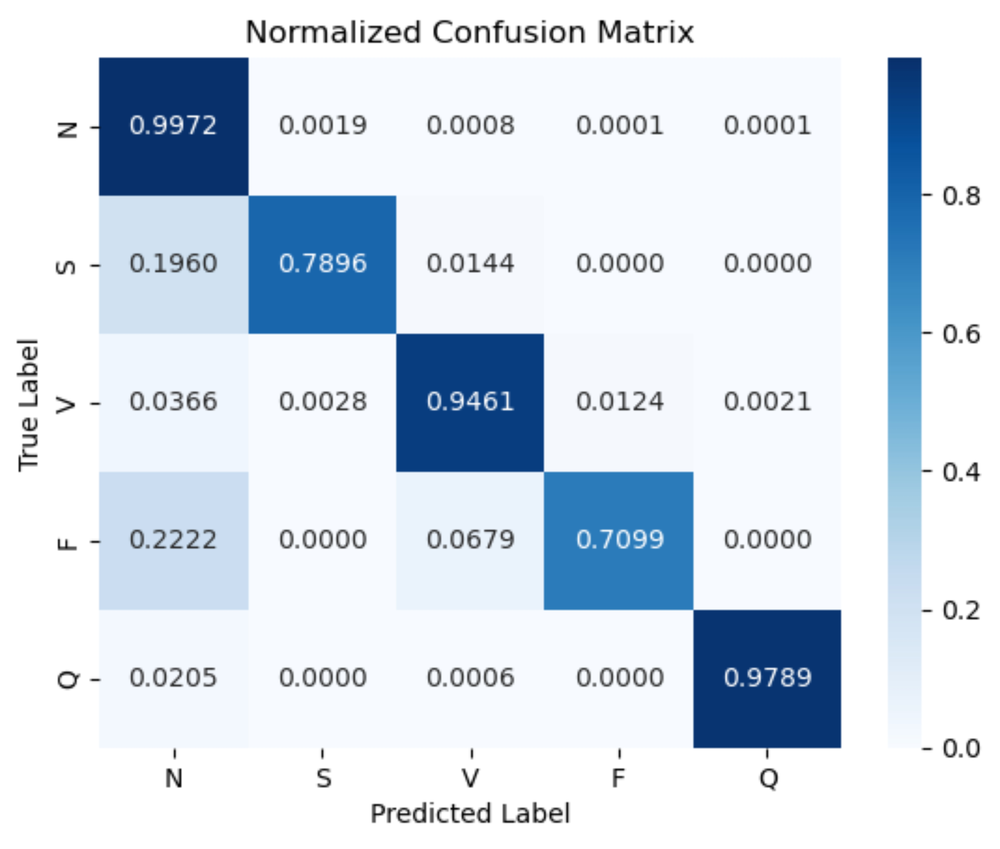
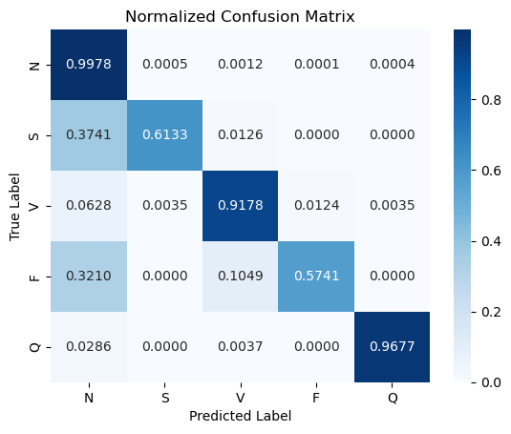
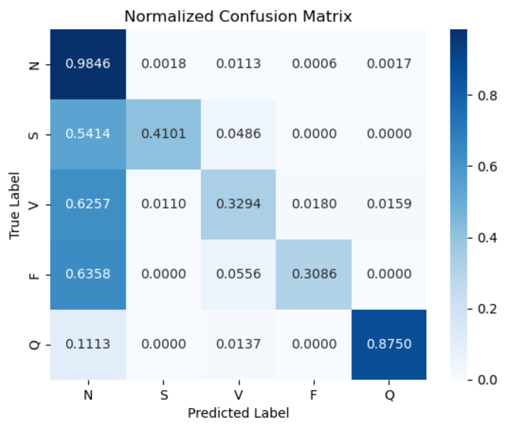
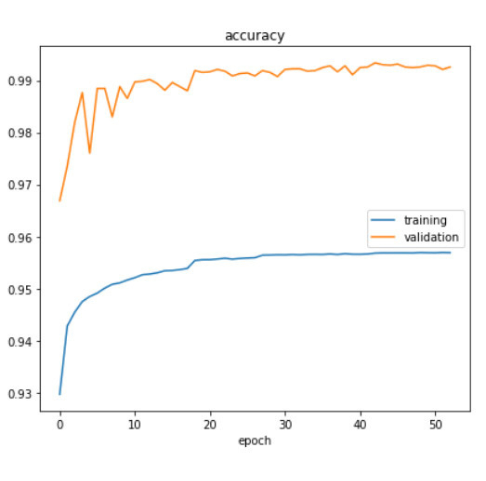
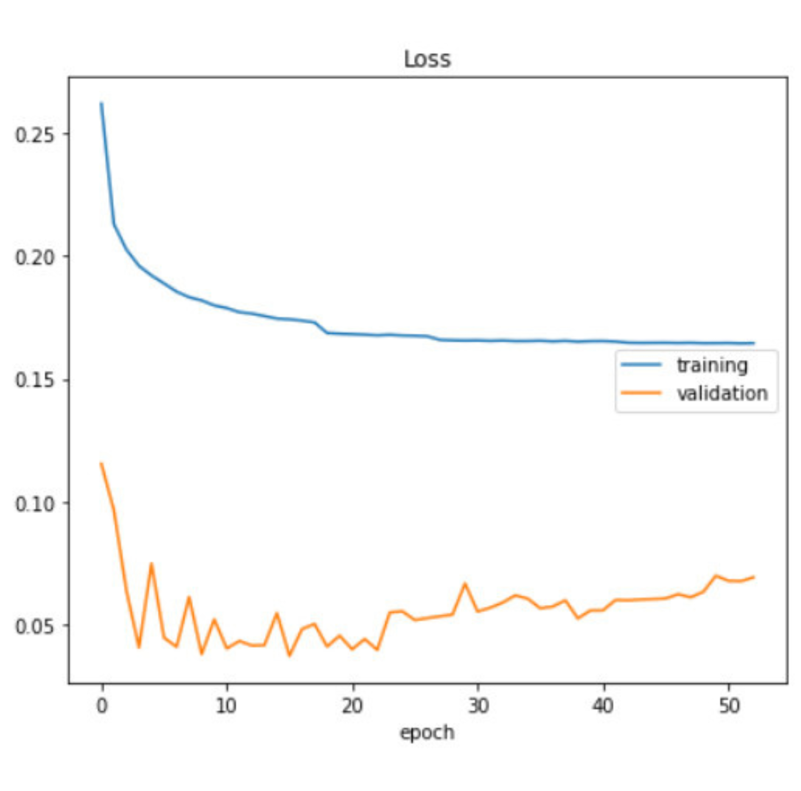

# Electrocardiogram-Based-Heart-Disease-Classification-with-Machine-Learning-Techniques
The TensorFlow code in this project classifies a single heartbeat from an ECG recording. Three classification models were tested: a 1-D Convolution Neural Network (CNN); a Support Vector Machine (SVM); and a Logistics Regression (LR) based on the CNN architecture. All models are implemented in Python.

## Authors
Thanh Hai Nguyen, http://orcid.org/0000-0002-1386-1390

An Hoang Cao, http://orcid.org/0009-0002-5608-0866

Phuong Ha Dang Bui, http://orcid.org/0000-0002-6179-3513

## Citation
DOI: https://doi.org/10.1007/978-3-031-41774-0_54

## Dataset
The original datasets used are [the MIT-BIH Arrhythmia
Dataset](https://www.physionet.org/physiobank/database/mitdb/) and [The PTB
Diagnostic ECG Database](https://www.physionet.org/physiobank/database/ptbdb/)

MIT-BIH Arrhythmia dataset :

* Number of Categories: 5
* Number of Samples: 109446
* Sampling Frequency: 125Hz
* Data Source: Physionet’s MIT-BIH Arrhythmia Dataset
* Classes: [’N’: 0, ‘S’: 1, ‘V’: 2, ‘F’: 3, ‘Q’: 4]

The PTB Diagnostic ECG Database

* Number of Samples: 14552
* Number of Categories: 2 ( Normal vs Abnormal)
* Sampling Frequency: 125Hz
* Data Source: Physionet’s PTB Diagnostic Database

The published preprocessed version of the MIT-BIH dataset does not fit the
description that authors provided of it in their paper as the former is heavily
unbalanced while the latter is not. This made it so my results are not directly
comparable to theirs. I sent the authors an email to have the same split as them
and I’ll update my results if I get a reply. A similar issue exists for the PTB
dataset.

## Model
#### Convocational Model
* The convolution model was taken from [Kachuee, Fazeli, & Sarrafzadeh \(2018\)](https://arxiv.org/pdf/1805.00794.pdf)

Model consists of:
* An initial 1-D convolution layer
* 5 repeated residual blocks (containing two 1-D convolution layers with a passthrough connection and `same` padding; and a max pool layer)
* A fully-connected layer
* A linear layer with softa output
* No regularization was used except for early stopping

## Results
### Convocational Model
Classification results of the improved algorithms by using StandardScaler combined with fine-tuned hyperparameter with RandomizedSearchCV

|         | 1D-CNN | SVM  | LR   |
| :------ | :----- | :--: | :--: |
| N       | 0.99   | 0.99 | 0.95 |
| S       | 0.88   | 0.75 | 0.55 |
| V       | 0.97   | 0.94 | 0.44 |
| F       | 0.84   | 0.68 | 0.40 |
| Q       | 1.00   | 0.98 | 0.92 |
| Accuracy| 0.99   | 0.98 | 0.91 |
| Macro avg| 0.94  | 0.87 | 0.65 |
| Weighted avg| 0.99 | 0.98 | 0.90 |

Confusion matrix for 1D-CNN classifier

Confusion matrix for SVM classifier

Confusion matrix for LR classifier

Classification performance of the proposed improved 1D-CNN model compared to some state-of-the-art studies

| Studies | Architecture | Accuracy | Precision | Recall | F1-Score |
| :--- | :--- | :---: | :---: | :---: | :---: |
| Proposed Model | CNN on 1D data | 99.30 | 95.30 | 93.30 | 94.40 |
| Nayan Nazrul Anuar [5] | ANN | 90.0 | – | – | – |
| Tao Wang [6] | CNN with CWT | 98.74 | – | – | 68.76 |
| M. Mohamed Suhail [12] | CNN with DWT | 90.67 | – | – | – |
| Abdelrahman M. Shaker [4] | CNN with GAN | 98.30 | 90.0 | 97.70 | – |
| Mohammad Rafi [10] | CNN and RNN | 98.0 | 90.80 | 84.40 | 97.40 |
| Amin Shoughi [8] | CNN with BI-LSTM | 98.71 | 92.50 | 94.40 | – |
| MM Farag [11] | CNN | 97.13 | – | 91.00 | 88.30 |

 Accuracy Plot        |       Loss Plot

    <figure style="margin-right: 20px;">
                
    </figure>
    <figure>
               
    </figure>

## Conclusion
Machine learning has emerged as a critical tool in medicine and automatic diagnosis owing to its ability to achieve high accuracy in medical data analysis. This study proposes a novel approach to improve machine learning’s performance in Author Proof electrocardiogram-based heart disease prediction by using the scaler combined with fine-tuned hyperparameter. As shown from the experiments, the results of the proposed approach, which improved the 1D-CNN model by using the scaler combined with fine-tuned hyperparameter, can get better results than previous studies, with 99.30%, 95.30%, 93.30%, and 94.40% in accuracy, precision, recall, and F1-score, respectively. However, independently fine-tuned hyperparameter did not significantly improve the performance. In addition, classic machine learning algorithms such as SVM and Logistic Regression can benefit from scaler rather than fine-tuned hyperparameter.
